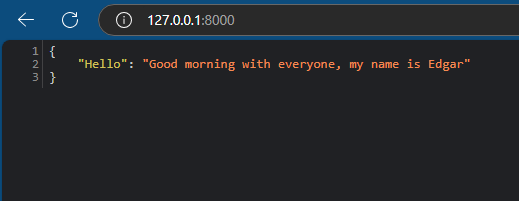

# FastAPI Microservice Example

This is a simple FastAPI application that exposes a REST API endpoint.

## Description

This project is a simple FastAPI microservice that provides a REST API with a single endpoint, `/`. The endpoint returns a greeting message. The application demonstrates the use of FastAPI to create a basic web service.

## Features

- FastAPI application.
- RESTful API with one endpoint: `/`.
- Returns a greeting message: "Good morning with everyone, my name is Edgar".

## Prerequisites

To run this application locally, you will need the following:

- Python 3.8 or higher
- pip (Python package installer)
- IDE or text editor like Visual Studio Code, PyCharm, or Sublime Text (optional but recommended)

## Installation

### Clone the repository

```bash
git clone https://github.com/epgarzonr10/FastAPI-Hello.git
cd FastAPIServicePython
```
### Install dependencies
```
pip install -r requirements.txt
```
## Run the Application
```
uvicorn main:app 
```
## Results
<p align="center">
  
</p>

> [!IMPORTANT]
> Once the server is running, you can access the service by navigating to the following URL in your browser or using a tool like curl:
> 
> ```
> http://localhost:8000
> ```
> 
> Ensure that the port matches the one being used by your development environment.

## Docker Hub Repository

The Docker image for this FastAPI project is hosted on Docker Hub. You can find all the details about how the Docker image was built, how to pull it, and how to run it in the repository.

### Link to the Repository:

[epgarzonr/fastapi-service](https://hub.docker.com/repository/docker/epgarzonr/fastapihello/general)

> **Note**  
> Visit the link to find:  
> - Instructions for building and running the image.  
> - Details about the construction of the Dockerfile.  
> - Pre-built image ready to use.  
